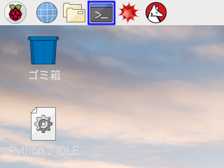

AIDOR ACCELERATION 基礎知識講座 第2回 | サンプルプログラム
===============================================================================

What's This?
-------------------------------------------------------------------------------

IoT・ロボットビジネス創出プログラム「[AIDOR ACCELERATION](https://www.imedio.or.jp/acceleration)」における、
2018年度 基礎知識講座 第2回で使用したサンプルプログラムです。


Getting Started
-------------------------------------------------------------------------------

Raspberry Piにログインした後、下記画像 青線部内のアイコンをクリックし**ターミナル**を開きます。



**ターミナル**上で、以下のコマンドを1行づつ入力します：

```sh
sudo pip install bottle wiringpi
sudo apt-get install python-opencv
```

これにより、

- `bottle`: HTTPサーバを作成するためのライブラリ
- `cv2`: 画像処理を行うためのライブラリ
- `wiringpi`: Raspberry PiのGPIOを制御するためのライブラリ

以上3点がインストールされます。


How to Use
-------------------------------------------------------------------------------

[ダウンロードリンク](https://github.com/Guvalif/imedio_0801/archive/master.zip)をクリックすることで、
プログラムを一式ダウンロードできます。

**ターミナル**上で`sudo idle`と入力し、**Python 2 IDLE**を起動します。
その後、メニューから`File -> Open...`とたどることで、それぞれのプログラムを開くことができます。

プログラムを実行するには、メニューから`Run -> Run Module`とたどります。

なお、同梱されるプログラムは以下の通りです：

- `adc.py`: A/DコンバータIC "MCP3208" で、アナログ信号を測定するためのライブラリ
- `example_analog.py`: アナログ信号を閲覧するプログラム
- `example_digital.py`: デジタル信号を閲覧するプログラム
- `example_camera.py`: カメラ画像を撮影するプログラム
- `example_servo.py`: サーボモータを動かすプログラム
- `example_http.py`: センサ・アクチュエータをインターネットリソース化するプログラム


Copyright (c) 2018,
-------------------------------------------------------------------------------

- [PLEN Project Company Inc.](https://plen.jp)
- [Kazuyuki TAKASE](https://github.com/Guvalif)

This software is released under [the MIT License](http://opensource.org/licenses/mit-license.php).